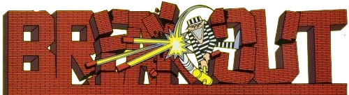

<div align="center">
    <a href="">
     
    </a>
  <h3>
    <strong>Clon del juego Breakout de Atari</strong>
  </h3>
  <h4>
    Basado en el proyecto de
    <a href="https://youtu.be/b6du6MvQmuQ?si=bQ0V93E6oN1TLMdp" target="_blank">midudev</a>
  </h4>
</div>

<div align="center">


</div>

## 🚀 Contribuir

1. Para contribuir, crea un [Fork](https://github.com/glaboryp/breakout-game/fork) del proyecto.

2. Clona el repositorio en tu máquina local:

```bash
git clone git@github.com:tu_username/breakout-game.git
```

3. Instala la extensión [**Live Preview**](https://marketplace.visualstudio.com/items?itemName=ms-vscode.live-server) en Visual Studio Code.

4. Presiona `F1` y selecciona `Live Preview: Start Server`.

5. Realiza los cambios y crea una pull request 🚀.

## 🛠️ Stack

- HTML, CSS & Javascript.


## 👑 Contribuidores

<a href="https://github.com/glaboryp/breakout-game/graphs/contributors">
  
</a>